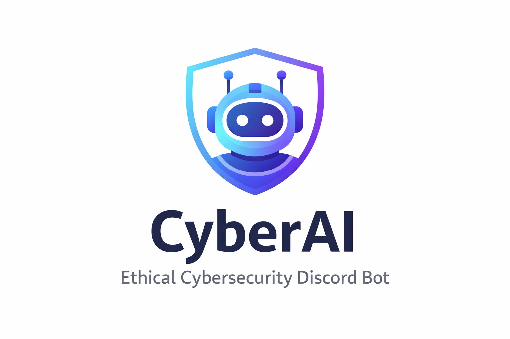
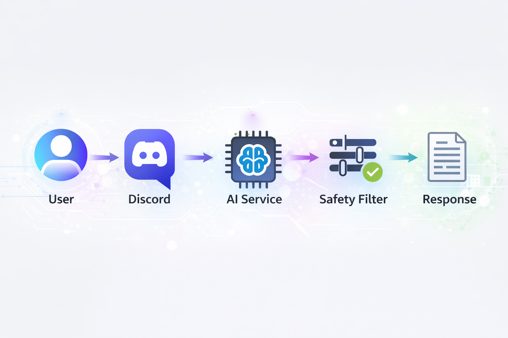

# CyberAI - Ethical Offensive Security Learning Assistant

CyberAI is a Discord bot that helps cybersecurity learners build structured, certification-aligned practice workflows while enforcing authorized-use boundaries.

## Abstract
CyberAI combines practical learning guidance, search-grounded recommendations, and safety-aware AI orchestration for offensive and defensive security education in authorized environments.

## Why This Matters
Many cybersecurity learners struggle with:
- Structuring their study path for certifications
- Knowing which labs to practice and in what order
- Understanding full attack-chain methodology
- Translating practice into professional reporting habits
- Staying within ethical and authorized boundaries

CyberAI addresses these challenges by combining structured learning workflows with AI-driven personalization and safety enforcement.

## Key Differentiators
- Structured progression workflows (`/studyplan`, `/roadmap`) instead of one-off generic advice
- Scope-aware red-team guidance with explicit authorization context (`/redteam`)
- Certification-aligned weekly plans with exam-readiness and alignment notes
- Search-grounded labs/resources/news with validated links, not hallucinated URLs
- Discord-safe response chunking that preserves formatting and readability
- Defensive awareness integrated into offensive-learning outputs

## What You Can Do
| Command | Value |
|---|---|
| `/studyplan` | Build certification-focused weekly prep plans |
| `/roadmap` | Generate phased learning roadmaps for a target role/goal |
| `/redteam` | Get authorized-scope red-team methodology guidance |
| `/labs` | Find relevant lab platforms and challenge paths |
| `/resource` | Curate useful articles, blogs, repos, books, and walkthroughs |
| `/news` | Track cybersecurity developments with practical context |
| `/quiz` | Practice with structured MCQ sets |
| `/explain` | Break down security concepts into practical learning chunks |
| `/tools` | Learn safe starter tooling and common setup pitfalls |

## Documentation
- [Architecture](docs/ARCHITECTURE.md)
- [Command Specification](docs/COMMAND_SPEC.md)

## Example Output (Study Plan Snippet)
```text
Week 4 - Active Directory Fundamentals
Focus: Enumeration and attack-path mapping
Deliverable: AD topology report with identified escalation paths

Certification Alignment:
This mirrors enterprise engagement flow expected in practical certifications.
```

## Responsible AI and Safety
- Input validation and prompt-injection checks before model generation
- Explicit scope gating for sensitive red-team style requests
- Rate limiting to reduce abuse and control cost
- Grounded selection for labs/resources/news (only links from fetched candidates)
- Safety-focused output rules that avoid weaponized instructions

## Security Testing Performed
The current implementation and validation flow covers:
- Prompt injection simulation attempts
- Malicious scope bypass attempts for offensive commands
- Rate limit behavior and retry-window handling
- Oversized response chunk validation for Discord constraints
- Null-input, malformed-input, and unsafe-pattern handling

## Known Limitations
- Prompt injection detection is primarily rule-based.
- Rate limiting is in-memory (Redis is better for horizontal scaling).
- No persistent chat memory by design (privacy-first behavior).
- Availability depends on external model and feed providers.

## Architecture At a Glance


```text
Discord Slash Command
  -> Command Handler
  -> Input Guard (sanitize + validate + injection checks)
  -> Rate Limiter
  -> Gemini Service (prompt orchestration + retries/fallback)
  -> Response Formatter + Smart Split
  -> Discord Reply/Follow-up
```

For deeper technical details, see `docs/ARCHITECTURE.md`.

## Quick Start
### Requirements
- Node.js 20+
- Discord bot token and application client ID
- Gemini API key

### Setup
1. Install dependencies:
```bash
npm install
```
2. Configure environment variables in `.env`.
3. Register slash commands:
```bash
npm run register
```
4. Start the bot:
```bash
npm start
```

Development mode:
```bash
npm run dev
```

## Environment Variables (Core)
| Variable | Required | Description |
|---|---|---|
| `DISCORD_TOKEN` | Yes | Discord bot token |
| `DISCORD_CLIENT_ID` | Yes | Discord application client ID |
| `DISCORD_GUILD_ID` | No | Guild-scoped command registration |
| `GEMINI_API_KEY` | Yes | Primary Gemini API key |
| `SERPER_API_KEY` | No | Search API key for `/labs` and `/resource` |

Additional tuning vars are available in `src/config/env.js`.

## Community Impact
CyberAI is designed to help:
- New learners build structured offensive methodology
- Intermediate students prepare for practical certifications
- Community members run exam-style simulation workflows in labs
- Users learn responsibly within explicit authorized scope

The goal is not automation, but disciplined security thinking.

## Intended Use
CyberAI is for authorized learning environments:
- Personal labs
- CTF platforms
- Internal approved simulation exercises

It is not intended for unauthorized real-world exploitation guidance.

CyberAI demonstrates that AI can enhance cybersecurity education while maintaining safety, structure, and responsibility. It is built not as an exploit generator, but as a structured learning assistant for ethical practitioners.
